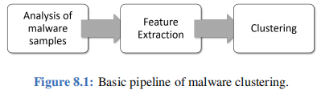

# 8 AI执行恶意软件聚类

## 8.1 安全问题

恶意软件，简称为恶意软件，一直是互联网用户面临的主要威胁之一。许多互联网安全问题都是由恶意软件的存在引起的。恶意软件有各种各样的变种，包括病毒、蠕虫、特洛伊木马、间谍软件、勒索软件、虚假警告软件、僵尸网络、Rootkit 和混合恶意软件。每种类型的恶意软件都有其自己的目的和传播方式。反恶意软件公司通过提供防御可变恶意软件的手段来保护互联网用户。许多自动化的恶意软件分析工具被开发出来，通过在受控环境中运行恶意软件，然后生成有关恶意软件行为的报告，以便检测恶意软件。

然而，由于恶意软件通常能够带来经济利益，恶意软件的变种、复杂性和数量显著增加。反恶意软件供应商通常每天会收到数千个新的恶意软件样本。尽管存在用于检查一种恶意软件行为的自动化恶意软件分析工具，但这只是防御的一部分，还不足以应对大量短时间内的恶意软件样本。在处理这种情况时，反恶意软件供应商需要有能力对需要最关注的恶意软件样本进行报告优先级排序。一种方法是将表现出类似行为的恶意软件样本进行聚类。这使得恶意软件分析人员能够快速自动地检测和关注那些要么是新颖且有趣的恶意软件，要么需要立即关注的恶意软件。

尽管恶意软件聚类（通过无监督机器学习）可能非常有帮助，但许多现有的恶意软件聚类方法存在两个主要限制：一是它们有限的能力将相关的恶意软件样本聚类在一起，另一个是它们在进行大规模的恶意软件聚类时的有效性有限。在本章中，我们基于一种成熟的恶意软件聚类技术提出了一个基于用例的用例，这种技术已经可以被反恶意软件公司用于对抗日益复杂的恶意软件。这个用例是基于一篇以前的研究论文，标题为“可扩展、基于行为的恶意软件聚类” \[7]。结果表明，这种类型的聚类方法不仅能够识别和分组表现出相似行为的恶意软件样本，而且非常可扩展。

## 8.2 机器学习Pipeline

由于本章的用例未使用任何深度学习技术，因此我们的流程与我们在第1章介绍的流程有所不同。图8.1显示了恶意软件聚类的整体过程。通常，包括3个步骤。在第一步中，对恶意软件样本进行分析，收集有关恶意软件的信息。对恶意软件进行的分析可以是静态的或动态的，唯一的区别在于在分析过程中是否执行恶意软件。在第二步中，基于前一步的分析结果提取恶意软件特征。特征总是经过精心选择，以便提取的特征能够清晰地表示不同恶意软件样本的不同行为。精心选择的特征为准确的恶意软件聚类奠定了坚实的基础。在最后一步，使用聚类算法根据提取的特征将恶意软件样本分组成簇。

<figure><figcaption></figcaption></figure>

本章描述的恶意软件聚类技术利用动态分析收集有关恶意软件样本的信息。第8.4.1小节详细介绍了分析的过程。先前的研究表明，静态分析在处理运行时打包代码和复杂混淆（这些经常用于复杂的恶意软件）时存在缺陷。此外，编写在代码上大不相同但在语义上相等的程序的可能性使得必须使用动态分析。在动态分析过程中集成了污点跟踪，以获取更好地捕捉恶意软件样本行为的重要特征。动态分析阶段的输出是带有污点信息的执行跟踪。然后，将跟踪总结为行为配置文件，这是执行跟踪的抽象，其中包含与系统调用相关的资源的信息，如文件或注册表键。接下来，将行为配置文件转换为特征集。此步骤的输出是一组以适合于聚类算法的形式呈现的特征。第8.4.2小节详细介绍了转换的过程。在最后一步，通过使用基于局部敏感哈希（LSH）的算法，对恶意软件样本进行可扩展的聚类。\

## 8.3 样本数据

在深入了解此用例的每个步骤是如何执行之前，我们展示了一个行为配置文件的示例和一个提取的特征的示例，以便读者直观了解它们的外观。图8.2a显示了一个程序的相应行为配置文件。请注意，尽管该程序以C编程语言显示，但生成行为配置文件的算法直接作用于动态分析生成的执行跟踪。

图8.2b显示了基于行为配置文件中控制流依赖信息提取的三个个体特征的示例。请记住，对于每个恶意软件样本，都会有一个相应的行为配置文件和从中转换而来的一组特征。

## 8.4 特征提取

在描述特征提取过程之前，我们不得不承认构建一个定制的动态恶意软件分析工具超出了本章的范围。相反，我们为读者提供了一些建议，说明如何使用现有的动态恶意软件分析工具获取适当的分析跟踪。

<figure><figcaption></figcaption></figure>

### 8.4.1 带有污染跟踪的动态分析

\
与许多先前的恶意软件聚类系统直接使用系统调用等低级数据不同，这个用例通过污点跟踪丰富和概括了从动态分析中收集到的信息。升级后的信息被总结成行为概要，显示了恶意软件的操作系统（OS）对象和OS操作的行为。

* **OS Objects（操作系统对象）：** "操作系统对象代表可以通过系统调用进行操作和查询的资源，例如文件或注册表键。形式上，操作系统对象是以下形式的元组：`OS Object ::= (type, [object-names])`，其中`type ::= dll|file|hook|network|object|process|registry|service|sync|system-info|time"`\[7]。
* **OS Operations（操作系统操作）：** "操作系统操作是对系统调用的概括。形式上，操作被定义为：`OS Operation ::= (operation-name, [operation-attributes], return_value)`\[7]。
* **Behavioral Profile（行为概要）：** 如\[7]中所述，“行为概要 P 被定义为 8 元组：`P = (O, OP, Γ, ∆, CV, CL, ΘCmpV alue, ΘCmpLabel)`，其中 O 是所有操作系统对象的集合，OP 是所有操作系统操作的集合，Γ ⊆ (O × OP) 是将一个或多个操作分配给每个对象的关系，∆ ⊆ ((O × OP) × (O × OP)) 表示依赖关系集。CV 是所有标签值比较操作的集合，而 CL 是所有标签-标签比较操作的集合。ΘCmpV alue ⊆ (CV × O) 是将标签值比较操作分配给操作系统对象的关系。ΘCmpLabel ⊆ (CL × O × O) 是将标签-标签比较操作分配给两个适当的操作系统对象的关系。”

总的来说，系统调用被视为污点跟踪系统中的污点源。更准确地说，所有系统调用的输出参数和返回值都被标记为污点。行为概要中包含三种类型的信息：

* 系统调用依赖。对系统调用的每个输入参数进行检查。如果被标记为污点，就会创建一个关于污点起源系统调用和当前系统调用之间的依赖关系。
* 控制流依赖。记录涉及被标记为污点的数据（系统调用的结果）的比较指令。在行为概要中总结了既包括标签值比较（未标记和被标记值之间的比较），也包括标签-标签比较（两个被标记值之间的比较）。
* 网络分析。分析相关的网络行为。

对于对恶意软件样本进行动态分析感兴趣的读者，可以参考 PANDA（Platform for Architecture-Neutral Dynamic Analysis），以提取系统调用跟踪和污点信息。在这里，我们列出了一些与我们的用例相关的可用插件。

### 8.4.2 特征生成

<figure><figcaption></figcaption></figure>

## 8.5 可扩展聚类

在第8.4节描述的特征提取过程之后，每个恶意软件样本都被表示为一组特征。从这一节开始，我们将介绍基于提取的特征集对恶意软件样本进行聚类的过程。为了使聚类过程可扩展，使反恶意软件厂商能够在短时间内对大量接收到的恶意软件样本进行分类，使用了一种称为局部敏感哈希（Locality-Sensitive Hashing，LSH）的技术。LSH 是一种算法技术，它以高概率将相似的输入项目哈希到相同的“桶”中。由于相似的项目最终位于相同的桶中，因此这种技术可用于数据聚类和最近邻搜索 \[81]。LSH 的结果呈现一个包含相似恶意软件样本对的集合。然后，通过相似性对该对集进行排序，这使我们能够生成一个单链接的分层聚类。图8.3展示了查找包含相似恶意软件样本对的集合的过程。

<figure><figcaption></figcaption></figure>

<figure><figcaption></figcaption></figure>

### 8.5.1 输入矩阵

恶意软件样本在能够被LSH算法处理之前需要进一步处理为输入矩阵。每个恶意软件样本都可以表示为一组特征。因此，所有恶意软件样本的集合可以表示为一个布尔矩阵，其中行代表所有特征，列代表所有样本。仅当 x 是 Y 的成员时，行 x 和列 Y 中的 1 才为真。表8.1描绘了一个表示总共有五个特征的两个恶意软件样本的示例布尔输入矩阵。请注意，在构建矩阵时应舍弃仅适用于一个恶意软件样本的特征，因为它们很少对找到相似的恶意软件对有用。

### 8.5.2 雅可比相似度

为了确定两个恶意软件样本的相似性，使用Jaccard相似性。两个集合U和V的Jaccard相似性定义为交集的大小除以样本集合的并集大小：

<figure><figcaption></figcaption></figure>

在我们的案例中，表8.1中两个示例恶意软件样本之间的Jaccard相似性是：

<figure><figcaption></figcaption></figure>

### 8.5.3 Min Hashing

\
对于大量的恶意软件样本和特征集，输入矩阵可能非常稀疏。对稀疏矩阵的进一步处理可能非常耗时和占用空间。因此，使用哈希将输入矩阵压缩成一个更加紧凑的签名矩阵。哈希函数H应该具有以下属性：

1. 如果similarity(m1, m2)较高，则P\[H(m1) == H(m2)]的概率较高。
2. 如果similarity(m1, m2)较低，则P\[H(m1) == H(m2)]的概率较低。

哈希函数的选择与相似性度量密切相关。对于Jaccard相似性，最小哈希是合适的。最小哈希函数对于行的随机排列产生相同值的概率等于这些集合的Jaccard相似性\[43]。对于表示所有恶意软件样本的输入矩阵进行最小哈希，生成行索引的排列。任何列的最小哈希是在排列顺序中，该列具有1的第一行的最小索引\[9]。行索引的排列数量决定了最小哈希结果的数量。例如，如果有100个行索引的排列，则每个原始输入矩阵列都有长度为100的签名列。图8.4显示了使用3个行索引排列、7x4输入矩阵以及生成的3x4签名矩阵的最小哈希示例。

<figure><figcaption></figcaption></figure>

最小哈希的实际实现。在实践中，当特征集很大时，生成真正的随机排列是低效的。解决这个问题的一种方法是使用形式为 hi(x) = ai1 x + ai2 mod P 的随机线性函数，其中 P 等于总特征数。计算签名矩阵 M(i, c) 的伪代码如算法1所示。

### 8.5.4 局部敏感哈希

局部敏感哈希的目标是生成一个候选对集，其相似性大于阈值 t。请注意，我们将签名矩阵中列的相似性视为输入矩阵中原始列的相似性的指示。由于逐个比较签名矩阵列中的所有行仍可能既耗时又占用空间，LSH的直觉是我们使用多个哈希函数对签名矩阵的列进行哈希。如果两个列中的任何一个在至少一个哈希函数中都哈希到相同的桶中，我们将这两列（代表两个恶意软件样本）视为候选对。

带状技术。如果我们有一个minhash签名矩阵，选择哈希的有效方法是将签名矩阵分成由每个包含 r 行的 b 个带。对于每个带，有一个哈希函数，它将 r 个整数的向量（该带内一个列的部分）哈希到一些大数量的桶。可以为所有带使用相同的哈希函数，但为每个带单独使用一个桶数组，因此在不同带中具有相同向量的列将不会哈希到相同的桶中。图8.5显示了一个带的哈希函数的示例。

<figure><figcaption></figcaption></figure>

<figure><figcaption></figcaption></figure>

参数选择。如\[43]所述，“假设我们使用 b 个带，每个带有 r 行，并且假设特定的一对文档具有 Jaccard 相似性 s。这些文档（或者更确切地说是它们的签名）在签名矩阵的任何特定行上的一致性的概率为 s。我们可以计算这些文档（或者说它们的签名）成为候选对的概率如下：

1. 在特定带的所有行中，签名一致的概率为 s r。
2. 在特定带的至少一行中签名不一致的概率为 1 − s r。
3. 在每个带的至少一行中签名不一致的概率为 (1 − s r) b。
4. 在至少一个带的所有行中签名一致的概率，因此成为候选对的概率为 1 − (1 − s r) b。 这可能不太明显，但不论选择了什么常数 b 和 r，这个函数都具有 S 曲线的形式，如图8.6所示。阈值大致位于上升最陡的位置，对于大的 b 和 r，我们发现相似性高于阈值的对很可能成为候选对，而低于阈值的对不太可能成为候选对 - 这正是我们想要的情况。阈值的近似值为 (1/b) 1/r。” 因此，由于 t = (1/b) 1/r，只需定义一个参数，即适当的 t，其中 br = n，其中 n 为总特征数，我们就能够找到适当的 r 和 b。

<figure><figcaption></figcaption></figure>

代码实现。下面展示了用于实现LSH的一些代码，分别是代码8.1和代码8.2。

## 8.6 聚类部署

根据第8.5节的结论，通过局部敏感哈希得到的结果集S只能近似于所有相近对的真实集合T。因此，可能存在将相似度低于阈值t的一些对纳入集合S的可能性。我们通过计算每对的相似度并丢弃相似度低于阈值的对来移除它们。我们得到一个候选对集，其相似度高于阈值t。利用这个集合，我们可以迭代遍历这些对，按相似度排序，并生成单链接凝聚聚类。

我们使用Python包scikit-learn 1.0.2来实现单链接凝聚聚类。请注意，参数"affinity"是用于计算链接的度量标准。“对于fit方法，需要一个距离矩阵而不是相似度矩阵作为输入\[65]”。我们可以通过1 - Jaccard相似度轻松计算一对之间的Jaccard距离。至于要找到的最佳簇的数量，可以使用Dendrogram方法找到适当的参数。由于LSH的结果仅提供具有高于阈值的相似度的对的信息，因此关于后续聚类步骤的信息，以合并相似度低于阈值的簇，不容易获取。为了获得详尽的分层聚类，仍然需要对现有簇的代表性进行精确的分层聚类，并对所有其他簇进行相同操作。尽管精确的分层聚类的时间复杂度为O(n^2)，但由于代表性和其他簇的数量通常不大，因此结果是可以接受的。

<figure><figcaption></figcaption></figure>

<figure><figcaption></figcaption></figure>

## 8.7 总结

### 8.7.1 时间复杂度&#x20;

对于大型数据集，此用例中算法的时间复杂度主要受到计算每对相似度的成本的影响。其中，|T| < nc，其中T是所有相近对的真实集合，n是恶意软件样本的数量，c是最大簇的大小。计算每对相似度的时间复杂度为O(ncd)，其中每对的计算成本为常量时间O(d)。\[7]

### 8.7.2 限制及可能的扩展

对于极大型数据集，时间复杂度可能较高。可以采用一些激进的聚类方案，但在准确性上可能会有所牺牲。由于代表恶意软件行为的特征是通过动态分析提取的，故意修改的恶意软件以使其行为与同一簇中的其他软件不同，将削弱聚类性能。

### 8.7.3 额外的资源

一些支持污点追踪的动态恶意软件分析工具如下：https://panda.re/；https://www.usenix.org/conference/raid2019/presentation/davanian。关于LSH的更多信息可以在http://www.mmds.org/找到。

